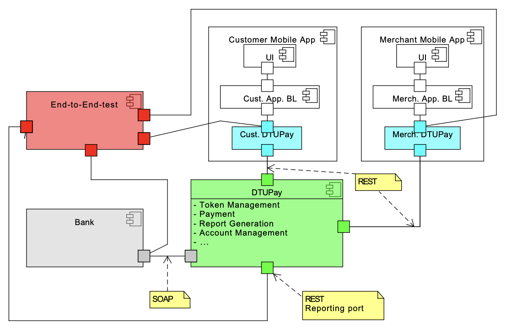

# DTUpay

DTU Pay is a company that offers a mobile payment option for shop owners (i.e. merchants) and
customers. Both, customers and merchants, already have a bank account with the bank (the bank is
supplied by me). To use the service, both, customers and merchants have to be registered with DTU
Pay by providing their names and other personal informatioon plus their bank account numbers that
have been obtained from the bank earlier. To take part in the mobile payment process, both, the
customer and the merchant, have to have mobile devices.
In the payment process, the customer presents a unique token he has previously received from
DTU Pay to the merchant, e.g. using RFID technology, as a proof, that the customer has agreed to
the payment (cf. Fig. 1),
For the payment, the customer has to have at least one unused token in his posession. A token
consists of a unique number/string (what is a good choice?). The tokens in the system should be
unique and it should not be possible to guess an unused token. Furthermore, for privacy reasons, the
tokens cannot contain any information about the customer to whom the token belongs. Only DTU
Pay knows to which customer a token belongs.
The customer can request 1 to 5 tokens if he either has spent all tokens (or it is the first time
he requests tokens) or has only one unused token left. Overall, a customer can only have at most 6
unused tokens.
If the user has more than 1 unused token and he requests again a set of tokens, his request will be
denied.
A token can only be used for one payment. DTU Pay holds a record of all payments done via DTU
Pay for each customer plus the tokens used in these payments

## Getting Started
### Prerequisites
- Docker and docker-compose are required to run the project.
- Maven is required to build the project.
- Java 11 is required to run the project.

### Testing
To run the tests, run the following command in the root directory of the project:
```
./scripts/run_and_test.sh
```
### Running
To run the project, run the following command in the root directory of the project:
```
./scripts/build_and_run.sh
```
